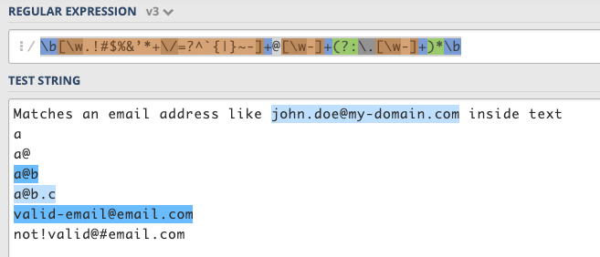
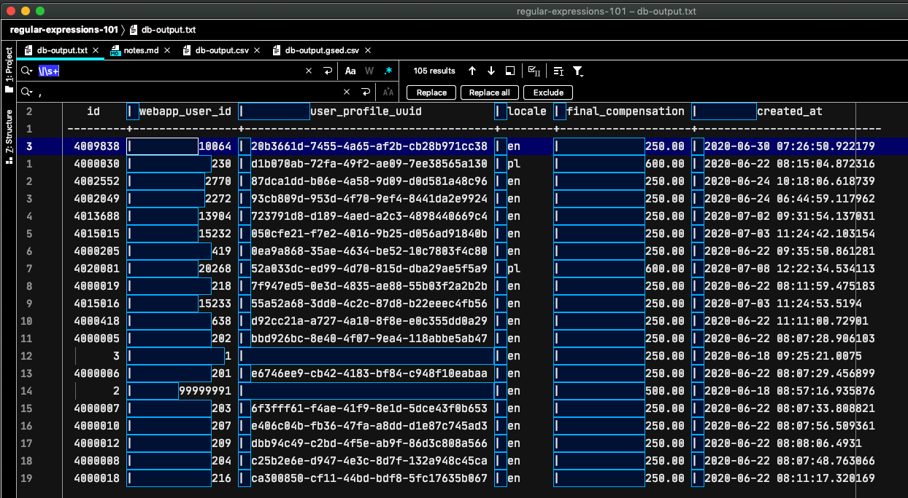

<!-- paginate: true -->
<!-- Scoped style -->
# Regex 101

## Paweł Przeniczny (@przprz)

---

# Regular expressions are:

### **patterns** (e.g. like ```kopytko```, ```\w+``` or ```[^qwe](\d\w+)\s{3}```)

### used to match **character combinations**...

### ...in **strings** (like in "look for `Mary` in *Mary had a little lamb...*")

---

# RegExps are implemented in most programming languages

- Ruby (RegExp class, https://ruby-doc.org/core-2.7.1/Regexp.html)
```
    foo = "faczynski ma malego kiutka"
    foo =~ /iutka/
```

- Java 
```
    String str = "some string";
    if (str.matches("^string")) { ... }
```

- JavaScript
```
    '^some'.test("some string")
    '^some'.exec("some string")
```

---

# RegExp are commonly implemented in most programming languages
- Python 
```
    import re
    re.search('^some', "some string")
```

- Rust 
```
    use regex::Regex;
    Regex::new("^some").unwrap().is_match("some string")
```

---
 
# Example in Ruby 

ruby-doc.org/core-2.7.1/Regexp.html

Excerpt from the docs:

```
/hay/ =~ 'haystack'   #=> 0
/y/.match('haystack') #=> #<MatchData "y">
```

If a string contains the pattern it is said to match. A literal string matches itself.

Here 'haystack' does not contain the pattern 'needle', so it doesn't match:

```
/needle/.match('haystack') #=> nil
```
Here 'haystack' contains the pattern 'hay', so it matches:

```
/hay/.match('haystack')    #=> #<MatchData "hay">
```

---

# What they can be used for?

- **validation** (e.g. check if a user input is well-formed or meets the defined criteria)

- **parsing** (e.g. to catch all URL parameters, capture text, etc.)

- **data scraping** (like in *web scraping*, find all pages that contain a certain set of keywords)

- **string replacement** (e.g. when coding - to rename a method or a variable)

- other **transformations** (e.g. to translate one form of text, like application output, to another) 

---

# Syntax: character classes

`.`          matches *any* character 

`\d`         matches a single character that is a digit 

`\w`         matches a word character (alphanumeric character plus underscore) 

`\s`         matches a whitespace character (includes tabs and line breaks)

Negations:

`\D`         is the negation of `\d`  
`\W`         is the negation of `\w`  
`\S`         is the negation of `\s`  

---

# Syntax: quantifiers (`*`, `+`, `?` and `{}`)

  `abc*`        matches a string that has `ab` followed by zero or more `c`'s
  
  `abc+`        matches a string that has `ab` followed by one or more `c`'s
  
  `abc?`       matches a string that has `ab` followed by zero or one `c`'s
  
  `abc{2}`      matches a string that has `ab` followed by 2 `c`'s
  
  `abc{2,}`     matches a string that has `ab` followed by 2 or more `c`'s
  
  `abc{2,5}`    matches a string that has `ab` followed by 2 up to 5 `c`'s
  
  `a(bc)*`      matches a string that has `a` followed by zero or more copies of the sequence `bc`
  
  `a(bc){2,5}`  matches a string that has `a` followed by 2 up to 5 copies of the sequence `bc`
  
---

# Syntax: anchors (`^` and `$`)

`^The`        matches any string that starts with `The`

`end$`        matches a string that ends with `end`

`^The end$`   exact string match (starts and ends with `The end`)

`roar`        matches any string that has the text `roar` in it

---

# Syntax: *or* operator (| or []), negation operator

`a(b|c)`     matches a string that has `a` followed by `b` or `c` (and captures `b` or `c`) 

`a[bc]`      same as previous, but without capturing `b` or `c`

Example usages:

`[abc]`            matches a string that has either an `a` or a `b` or a `c` -> is the same as `a|b|c`

`[a-c]`            same as previous, but with range operator `-`

`[a-fA-F0-9]`      a string that represents a single hexadecimal digit, case insensitively 

`[0-9]%`           a string that has a character from `0` to `9` before a `%` sign

Negation operator:
`[^a-zA-Z]`        a string that has not a letter from `a` to `z` or from `A` to `Z`. In this case the `^` is used as **negation** of the expression

---

# Syntax: flags

Most popular:

`g` - *global* - does not return after the first match, restarting the subsequent searches from the end of the previous match

`m` - *multi-line* - when enabled `^` and `$` will match the start and end of a line, instead of the whole string

`i` - *insensitive* - makes the whole expression case-insensitive (for instance `/aBc/i` would match `AbC`)

##### Caveat: 

Flags are **language-specific**, e.g. in PHP you use `s` to enable multi-line mode. 

---

# Syntax: grouping and capturing: `()`

`a(bc)`           parentheses create a capturing group with value `bc`

`a(?:bc)*`        using `?:` we disable the capturing group, so here the match object will *not* contain `bc`

`a(?<foo>bc)`     using `?<foo>` we put a name to the group

---

# Syntax: greedy and lazy matching
The quantifiers (`*` `+` `{}`) are greedy operators - they expand the match as far as they can through the provided text.

E.g. `<.+>` matches `<div>simple div</div>` in `This is a <div> simple div</div> test`. 

In order to catch only the div tag we can use a `?` to make it lazy:

`<.+?>` matches any character one or more times included inside < and >, expanding as needed 

https://regex101.com/r/cO8lqs/24

---

# Syntax: boundaries - `\b` and `\B`

`\babc\b`          performs a "whole words only" search (here it won't match `aabcd` in "abc aabcd" )

`\Babc\B`         matches only if the pattern is fully surrounded by word characters (here it won't match `abc` in "abc aabcd" )

---

# Syntax: back-references - `\1` (`\2` and so on)
`([abc])\1`              using `\1` it matches the same text that was matched by the first capturing group 

`([abc])([de])\2\1`      we can use `\2` (`\3`,`\4` etc.) to identify the same text that was matched by the second (third, fourth, etc.) capturing group 

`(?<foo>[abc])\k<foo>`   we add the name foo to the group and we reference it later (`\k<foo>`). 
The result is the same as in the first regex.

---

# Syntax: look-ahead, look-behind — `(?=)` and `(?<=)`

`d(?=r)`       matches a `d` only if is followed by `r`, but `r` will not be part of the overall regex match 

`(?<=r)d`      matches a `d` only if is preceded by an `r`, but `r` will not be part of the overall regex match 

---

# Example - email validation 

- it ain't easy if you apply RFC822 strictly...
https://stackoverflow.com/questions/201323/how-to-validate-an-email-address-using-a-regular-expression

```
(?:[a-z0-9!#$%&'*+/=?^_`{|}~-]+(?:\.[a-z0-9!#$%&'*+/=?^_`{|}~-]+)*|"(?:[\x01-\x08\x0b\x0c\x0e-\x1f\x21\x23-\x5b\x5d-\x7f]|\\[\x01-\x09\x0b\x0c\x0e-\x7f])*")@(?:(?:[a-z0-9](?:[a-z0-9-]*[a-z0-9])?\.)+[a-z0-9](?:[a-z0-9-]*[a-z0-9])?|\[(?:(?:(2(5[0-5]|[0-4][0-9])|1[0-9][0-9]|[1-9]?[0-9]))\.){3}(?:(2(5[0-5]|[0-4][0-9])|1[0-9][0-9]|[1-9]?[0-9])|[a-z0-9-]*[a-z0-9]:(?:[\x01-\x08\x0b\x0c\x0e-\x1f\x21-\x5a\x53-\x7f]|\\[\x01-\x09\x0b\x0c\x0e-\x7f])+)\])
```

- ...but can be quite simple if you're not paranoid
 
https://regex101.com/r/70ARRh/3



---

# Examples from AH repo:
- Webapp: validation of bank details provided by PAX
    https://github.com/AirHelp/ah-webapp/blob/88dae720285026a9465f41a3f05bd91abe5ebaeb/app/services/validate_free_bank_transfer_details.rb
    regexps taken from private Ruby gem
    https://github.com/AirHelp/ah-payments-reference-data/blob/8c35f6133b55e2064ae2d20313e4aac3438bc6f3/lib/ah/payments/reference/data/fields.json
---

# Examples from AH repo:
- Midass: validation of bank details provided by PAX
    https://github.com/AirHelp/ah-midass/blob/89b20280f782e68a2445d2fe966012fa0558365c/app/services/dlocal/validate_bank_transfer_details.rb
---
    
# Examples from AH repo:
- Skynet: parsing Boarding Pass scan from mobile app 
https://github.com/AIrHelp/ah-skynet/blob/e8afa9087b19dce5a4596eb41c9d24c073400233/app/services/parse_boarding_pass.rb
---

# Can be used in IDE to search & replace
IDE will highlight matches so you can test if your regex works as expected. 


---
           
# Can be used in sed
Here we use 2 sed commands: *replace* and *delete*; also we apply *g* flag to apply to *all occurrences* in line
```sh
# redirect output of one gsed operation to another until desired effect is reached 
gsed 's/|/,/g' db-output.txt | \   # replace pipes with commas in db-output.txt
  gsed 's/\s\+,/,/g'         | \   # replace spaces followed by comma with comma
  gsed 's/,\s\+/,/g'         | \   # replace comma followed by spaces with comma
  gsed 's/^\s\+//'           | \   # delete (replace by nothing) spaces at the beginning of line  
  gsed '/--/d'                     # delete lines with '--'
```

```
# or use multiple gsed commands joined with semicolons in one invocation
gsed 's/|/,/g; s/\s\+,/,/g; s/,\s\+/,/g; s/^\s\+//; /--/d' db-output.txt
```

```
# the same as above but split to multiple lines for readability
gsed -e 's/|/,/g'      \
     -e 's/\s\+,/,/g'  \
     -e 's/,\s\+/,/g'  \
     -e 's/^\s\+//'    \
     -e '/--/d'        \
     db-output.txt
```

---

# sed - caveats 
- GNU sed & BSD/POSIX sed differ 

  Rule of thumb: use the modern one, i.e. _GNU_ sed 
  ```
  brew install gsed # on OSX
  ```
  
- there are some syntactic differences programming language regex and GNU sed regexes
    - sed uses POSIX syntax (basic regular expressions),
     so some escape sequences (eg. `\|`, `\+`, `\?`) are not defined
     
        see _Regex syntax clashes_ at http://www.gnu.org/software/sed/manual/sed.html
    
    - some macros/character classes don't work in sed
    eg. ```\d```, https://stackoverflow.com/questions/14671293/why-doesnt-d-work-in-regular-expressions-in-sed)
    
---

# Final notes

- try to *keep it simple* (for better performance & understandability) 

- sometimes it's easier to use *or* operator (`|`) than creating more general regular expression

- read the *language documentation*
 
- (especially when re-using a regexp written in one programming language in a different language)
 
---

# References:
- **The Stack Overflow Regular Expressions FAQ**
    https://stackoverflow.com/questions/22937618/reference-what-does-this-regex-mean/22944075#22944075
    
- MDN Regular Expressions (JavaScript) 
    https://developer.mozilla.org/en-US/docs/Web/JavaScript/Guide/Regular_Expressions
    
- Lots of examples with explanations (kudos to Jonny Fox, I used lots of them in this presentation)
    https://medium.com/factory-mind/regex-tutorial-a-simple-cheatsheet-by-examples-649dc1c3f285
    
- Examples in various programming languages 

  http://rosettacode.org/wiki/Regular_expressions
  
---
